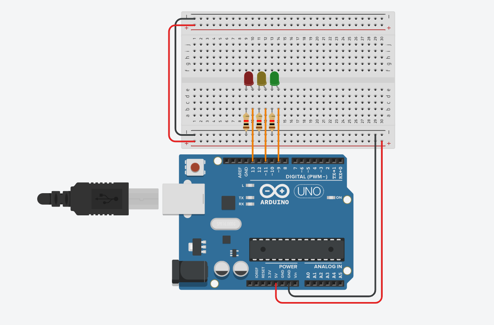
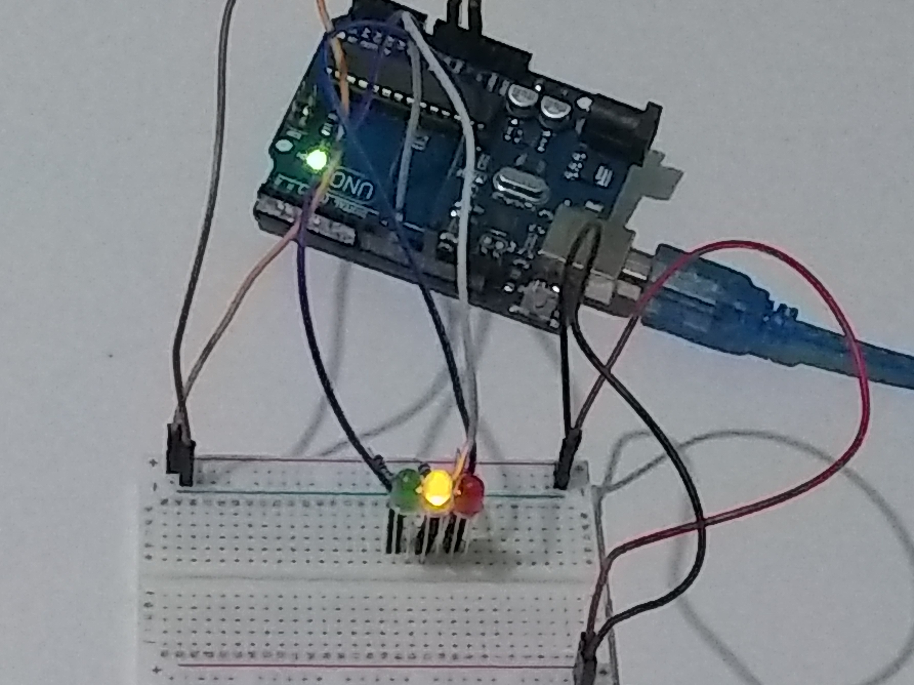

### Materiais necessários:
- 1 Arduino Uno;
- 1 cabo USB;
- 1 Led Vermelho;
- 1 Led Amarelo;
- 1 Led Verde;
- 3 Resistores;
- 7 Jumpers macho-macho.

### Projeto no TinkerCad:
[](https://www.tinkercad.com/embed/hTGyLWGa3Qd?editbtn=1)

### Código:
```
// C++ code
//
#define ledVermelho 13
#define ledAmarelo 10
#define ledVerde 9
void setup()
{
  pinMode(ledVermelho, OUTPUT);
  pinMode(ledAmarelo, OUTPUT);
  pinMode(ledVerde, OUTPUT);
}

void acenderLed(int led, bool acender){
  digitalWrite(led, acender ? HIGH : LOW);
}

void loop()
{
  acenderLed(ledVermelho, false);
  acenderLed(ledAmarelo, true);
  acenderLed(ledVerde, false);
  delay(1000);
  acenderLed(ledAmarelo, false);
  acenderLed(ledVerde, true);
  delay(1000);
}
```

### Instruções para a construção:
- Conecte o Arduino e a protobard conforme o protótipo no TinkerCad;
- Adicione então os 3 leds nos locais de sua preferência na protoboard;
- Na fila horizontal onde está cada led, adicione um resistor e também um jumper, que também será conectado a uma entrada do Arduino;
- Carregue o programa para o Arduino e pronto, seu protótipo deverá funcionar igual ao da foto abaixo!

### Foto do protótipo após essa etapa:
