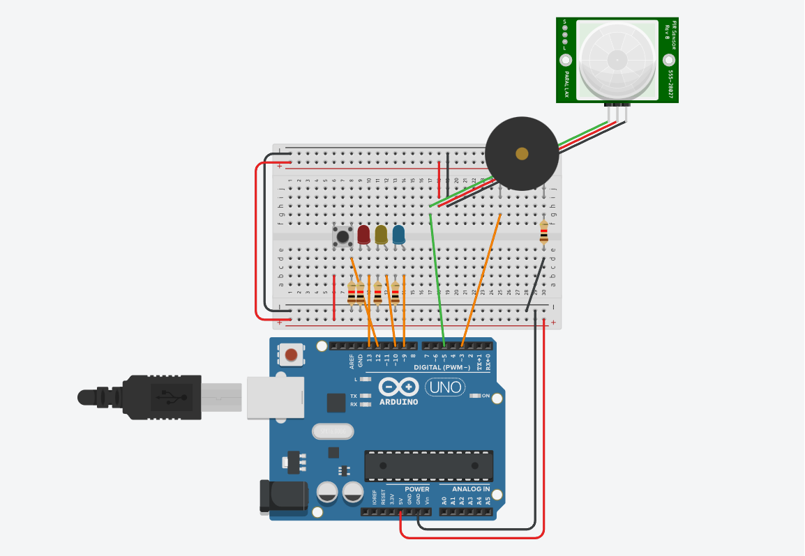
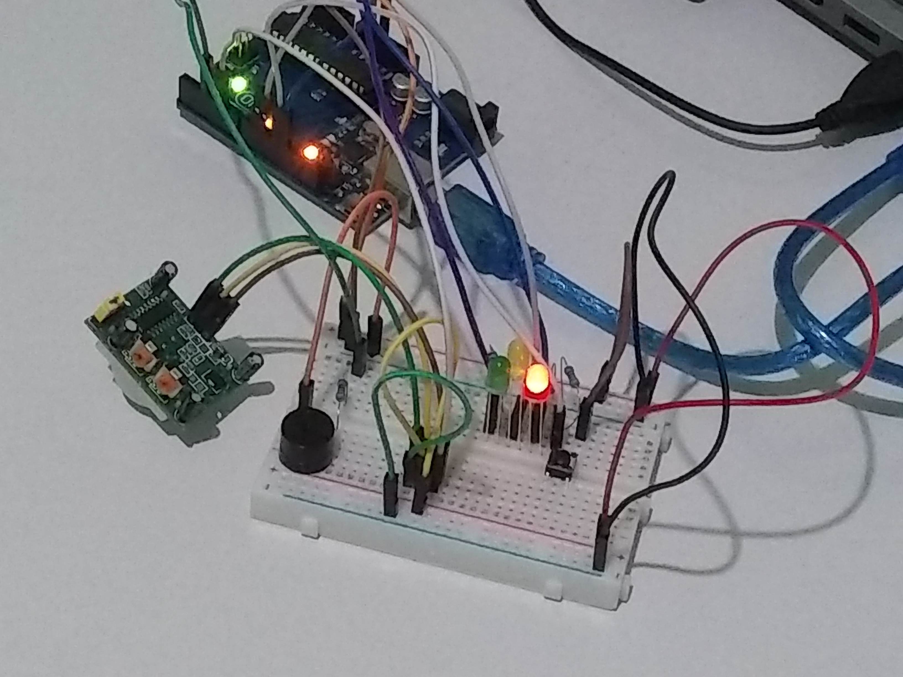
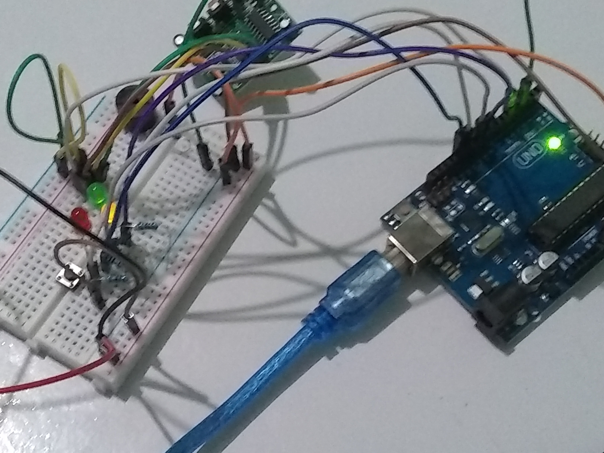

### Materiais necessários:
- 1 Arduino Uno;
- 1 cabo USB;
- 1 Led Vermelho;
- 1 Led Amarelo;
- 1 Led Verde;
- 1 Botão (chave táctil);
- 1 Buzzer;
- 1 Sensor PIR (sensor de presença);
- 5 Resistores;
- 3 Jumpers macho-fêmea;
- 14 Jumpers macho-macho.

### Projeto no TinkerCad:
[](https://www.tinkercad.com/embed/87dhyKf8pBS)

### Código:
```
// C++ code
//
#define ledVermelho 13
#define ledAmarelo 10
#define ledAzul 9
#define pir 5
#define botao 12
#define buzzer 3
int ligado = 1;
int botaoPressionado = 0;
int botaoEstadoAnterior = 0;
void setup()
{
  pinMode(LED_BUILTIN, OUTPUT);
  pinMode(ledVermelho, OUTPUT);
  pinMode(ledAmarelo, OUTPUT);
  pinMode(ledAzul, OUTPUT);
  pinMode(pir, INPUT);
  pinMode(botao, INPUT);
  pinMode(buzzer, OUTPUT);
}

void acenderLed(int led, bool acender){
  digitalWrite(led, acender ? HIGH : LOW);
}

void loop()
{
  botaoPressionado = digitalRead(botao);
  if (botaoPressionado == 1 && botaoEstadoAnterior == 0) {
    ligado = 1 - ligado;
    delay(20);
  }
  botaoEstadoAnterior = botaoPressionado;
  if (ligado){
    int sinalPir = digitalRead(pir);
  	if (sinalPir == 1){
    	acenderLed(ledAmarelo, false);
    	acenderLed(ledAzul, false);
    	acenderLed(ledVermelho, true);
      	tone(buzzer,850);
    	delay(300);
    	acenderLed(ledVermelho, false);
      	noTone(buzzer);
    	delay(300);
  	} else {
   	 	acenderLed(ledVermelho, false);
     	acenderLed(ledAmarelo, true);
     	acenderLed(ledAzul, false);
     	delay(300);
     	acenderLed(ledAmarelo, false);
     	acenderLed(ledAzul, true);
     	delay(300);
  	}
  } else {
    acenderLed(ledAmarelo, false);
    acenderLed(ledAzul, false);
    acenderLed(ledVermelho, false);
    noTone(buzzer);
  }
}
```

### Instruções para a construção:
- [Siga as instruções da etapa 1](../etapa1/etapa1.md);
- Adicione o botão na protoboard conforme indicado no protótipo. Conecte, com um jumper o botão ao Arduino e adicione um resistor;
- Adicione o buzzer na protoboard e o conecte ao Arduino através de um jumper. Adicione um resistor na linha horizontal que o componente está conectado;
- Conecte o sensor PIR na protoboard através de jumpers macho-fêmea. Depois disso, através de outro jumper, o conecte a uma porta digital do Arduino;
- Carregue o programa para o Arduino e pronto, seu protótipo deverá funcionar igual ao da foto abaixo!

### Fotos do protótipo após essa etapa:

