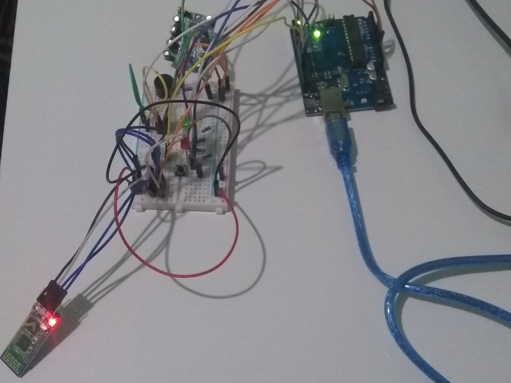

### Materiais necessários:
- 1 Arduino Uno;
- 1 cabo USB;
- 1 Led Vermelho;
- 1 Led Amarelo;
- 1 Led Verde;
- 1 Botão (chave táctil);
- 1 Buzzer;
- 1 Sensor PIR (sensor de presença);
- 1 Módulo Bluetooth HC-05;
- 7 Resistores;
- 7 Jumpers macho-fêmea;
- 20 Jumpers macho-macho.

### Projeto no TinkerCad da versão 2:
[](https://www.tinkercad.com/embed/87dhyKf8pBS)
O TinkerCad não tem a opção de módulo bluetooth, a funcionalidade adicionada nesta versão. Para instruções específicas sobre o módulo, [consulte este link](https://mundoprojetado.com.br/modulo-bluetooth-comunicando-c-arduino-parte-1/). 

### Código:
```
// C++ code
//
#include <SoftwareSerial.h>
const int pinoRX = 6;
const int pinoTX = 9;
int dadoRecebidoBluetooth = 0;
SoftwareSerial bluetooth(pinoRX, pinoTX);
#define ledVermelho 13
#define ledAmarelo 10
#define ledVerde 8
#define pir 5
#define botao 12
#define buzzer 3
int ligado = 1;
int botaoPressionado = 0;
int botaoEstadoAnterior = 0;
void setup()
{
  pinMode(LED_BUILTIN, OUTPUT);
  pinMode(ledVermelho, OUTPUT);
  pinMode(ledAmarelo, OUTPUT);
  pinMode(ledVerde, OUTPUT);
  pinMode(pir, INPUT);
  pinMode(botao, INPUT);
  pinMode(buzzer, OUTPUT);
  Serial.begin(9600);
  bluetooth.begin(9600); 
}

void acenderLed(int led, bool acender){
  digitalWrite(led, acender ? HIGH : LOW);
}

void loop()
{
  botaoPressionado = digitalRead(botao);
  if (botaoPressionado == 1 && botaoEstadoAnterior == 0) {
    ligado = 1 - ligado;
    dadoRecebidoBluetooth = 0;
    delay(20);
  }
  botaoEstadoAnterior = botaoPressionado;
  if (ligado){
    int sinalPir = digitalRead(pir);
    if(dadoRecebidoBluetooth == 0 && bluetooth.available()){
      dadoRecebidoBluetooth = bluetooth.read();
    }
  	if (sinalPir == 1 && dadoRecebidoBluetooth == '1'){
    	acenderLed(ledAmarelo, false);
    	acenderLed(ledVerde, false);
    	acenderLed(ledVermelho, true);
      	tone(buzzer,850);
    	delay(300);
    	acenderLed(ledVermelho, false);
      	noTone(buzzer);
    	delay(300);
  	} else {
   	 	acenderLed(ledVermelho, false);
     	acenderLed(ledAmarelo, true);
     	acenderLed(ledVerde, false);
     	delay(100);
     	acenderLed(ledAmarelo, false);
     	acenderLed(ledVerde, true);
     	delay(100);
  	}
  } else {
    acenderLed(ledAmarelo, false);
    acenderLed(ledVerde, false);
    acenderLed(ledVermelho, false);
    noTone(buzzer);
  }
}
```

### Instruções para a construção:
- [Siga as instruções da etapa 2](../etapa2/etapa2.md);
- Conecte o módulo bluetooth a protoboard e ao Arduino. Para isso, você precisará de duas portas digitais livres na sua placa, para o fluxo de envio e recebimento de dados. Por padrão, essa comunicação só seria possível utilizando as portas 0 e 1, porém, preferimos não utilizá-las, já que isso poderia gerar erro no carregamento do programa ao Arduino. Podemos utilizar outras portas para essa comunicação graças a bilioteca SoftwareSerial, importada no nosso programa.
- Carregue o programa para o Arduino e pronto, seu protótipo deverá funcionar igual ao da foto abaixo!
- Para realizar os testes da comunicação via bluetooth, você pode utilizar o aplicativo [Bluetooth Terminal HC-05](https://play.google.com/store/apps/details?id=project.bluetoothterminal&hl=pt_BR&gl=US). Basta enviar "1" para se comunicar com o dispositivo.

### Fotos do protótipo após essa etapa:
